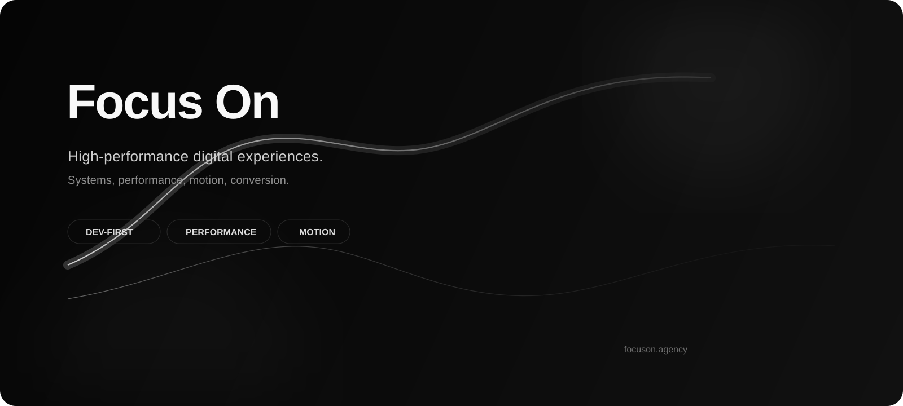
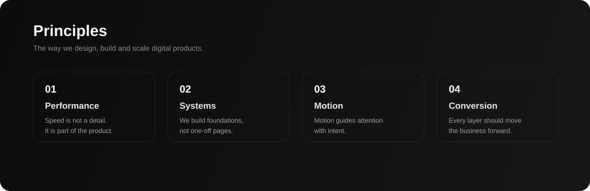

# Focus On

<p align="left">
  
</p>

<p align="left">
  <a href="https://focuson.agency">
    
  </a>
  <a href="mailto:hello@focuson.agency">
    
  </a>
</p>

<p align="left">
  
  
  
  
</p>

## We build systems that perform

Focus On is a digital agency focused on high-performance web experiences, custom software and conversion-driven e-commerce.

We combine engineering precision, visual direction and business intent to build products that are fast, scalable and memorable.

---

## Selected capabilities

<table>
  <tr>
    <td valign="top" width="33%">
      <strong>Engineering</strong><br/><br/>
      Custom WordPress<br/>
      Laravel development<br/>
      Web applications & SaaS<br/>
      API-first integrations
    </td>
    <td valign="top" width="33%">
      <strong>Commerce</strong><br/><br/>
      WooCommerce ecosystems<br/>
      Shopify integrations<br/>
      CRO-oriented UX<br/>
      Tracking & analytics
    </td>
    <td valign="top" width="33%">
      <strong>Experience</strong><br/><br/>
      UX/UI design<br/>
      Brand-oriented interfaces<br/>
      Performance optimization
    </td>
  </tr>
</table>

---

## Core stack

<p align="left">
  
</p>

**Ecosystem**
- Roots (Bedrock, Acorn)
- WooCommerce
- Shopify integrations
- REST and API-first architectures

**Frontend & motion**
- GSAP
- Alpine.js
- Swiper
- Component-based systems
- Data-attribute driven animations

---

## Visual principles

<p align="left">
  
</p>

---

## Operating principles

```txt
Performance   →   Design   →   Systems   →   Conversion
```

- Speed is part of the product
- Motion should clarify, not distract
- Every layer should support growth
- Simplicity scales better than noise

---

## What makes our repositories different

- Clean and maintainable structure
- Production-ready mindset
- Minimal dependencies where possible
- Developer-first experience
- Strong visual taste without sacrificing performance

---

## Work with us

If you're building something ambitious, we should talk.

- Website: https://focuson.agency
- Email: hello@focuson.agency

---

<p align="left">
  <sub>Built with intent.</sub>
</p>
